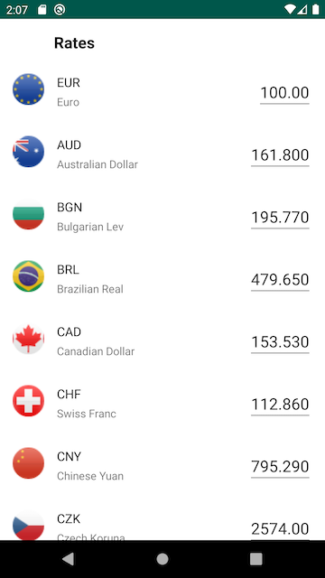

## About

Simple exchange rates app following Clean Architecture principles. The idea is to take advantage of the Kotlin Programming Language features plus also pull in lessons learned and ideas from other interesting aproaches like Functional Programming.

Demonstrates the best use of Android frameworks to create maintainable, scalable and testable code.

## Implementation details:

- Three layers: `data, domain, internal, presentation`
- `data` contains `local` and `network` data sources
- `data` also contains `ExchangeRatesDatasource` which implements the `ExchangeRatesRepository` from `domain` layer
- `domain` is the business logic split in several Use Cases
- `presentation` is the UI layer  
- Each layer has it's own `model` package to favor testing and independence from external sources

- `Dagger2` has been used to enable inversion of control and dependency injection.
- `RxJava2` is used here to facilitate the Observer pattern 
- `ViewModel` is used to persist already loaded data accross configuration changes  

- `minSdkVersion 24` is chosen to favor fast compile times during the
  development

### ----------------------------------------------------------------------------------------------
 
## Code style
Official Android Studio default built-in codeStyle has been used for this project.

## License

    Copyright 2019 Vito Valov

    Licensed under the Apache License, Version 2.0 (the "License");
    you may not use this file except in compliance with the License.
    You may obtain a copy of the License at

       http://www.apache.org/licenses/LICENSE-2.0

    Unless required by applicable law or agreed to in writing, software
    distributed under the License is distributed on an "AS IS" BASIS,
    WITHOUT WARRANTIES OR CONDITIONS OF ANY KIND, either express or implied.
    See the License for the specific language governing permissions and
    limitations under the License.
